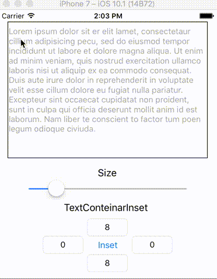

# SimpleCustomizableTextView

Simple customizable UITextView subclass that adds Placeholder and ToolBar written in Swift.

<p align="center"></p>


# Features


[](https://github.com/Carthage/Carthage)
[](http://mit-license.org)
[](https://developer.apple.com/swift)

- Placeholder similar to UITextField
- AccessryView on keyboard
- Closing keyboard
- Support @IBDesignable and @IBInspectable
- Support Swift 3.0
- Compatible with Carthage


## Demo App

To run the example project, clone the repo, and run `pod install` from the Example directory first.

Open `Example/SimpleCustomizableTextView.xcworkspace` and run `SimpleCustomizableTextView-Example` to see a simple demonstration.


## Usage

### Initialization

***SimpleCustomizableTextView*** can be initialized in a way same as UITextView

```swift
let textView = SimpleCustomizableTextView(frame: CGRect(x: 10, y: 20, width: 200, height: 300))
```

`SimpleCustomizableTextView` is available in Interface Builder.
Set custom class of `UITextView` to `SimpleCustomizableTextView`

```swift
@IBOutlet weak var textView: SimpleCustomizableTextView!
```

### Placeholder setting

Please set text `placeholder` property.

```swift
textView.placeholder = "Set placeholder in SimpleCustomizableTextView."
```

### AccessaryView setting

SimpleCustomizableTextView have customizable accessaryView on keyboard.
You can close a keyboard if you push `UIBarButtonItem`.

`/// set gif ///`

if you want to change accessaryView style, you should use `accessoryViewStyle`, `barItemTitle`, `barItemTitleColor`, `barItemTitleFont`.

```swift
textView.accessoryViewStyle = .blackOpaque          // default is .default
textView.barItemTitle = "Close"                     // default is "Done"
textView.barItemTitleColor = UIColor.white          // default is UIColor.black
textView.barItemTitleFont = UIFont.italicSystemFont(ofSize: 20) // default is .systemFont(ofSize: UIFont.buttonFontSize)
```

if you don't use `accessaryView`, set `accessoryViewIsHidden` to `ture`.

```swift
textView.accessoryViewIsHidden = ture
```

### SimpleCustomizableTextViewDelegate

Asks the delegate if the `SimpleCustomizableTextView` should process the pressing of the bar button.
`true` if the `SimpleCustomizableTextView` should implement its default behavior for the bar button; otherwise, `false`.

if you set `false`, the keyboard is not closed.

```swift
extension ViewController: SimpleCustomizableTextViewDelegate {
    public func SimpleCustomizableTextViewShouldDone(_ textView: SimpleCustomizableTextView) -> Bool {
        // do something (if you want to implement any behavior before closing the keyboard)
        return true
    }
}

```

## Requirements

- iOS 8.0+
- Xcode 8.0+
- Swift 3.0+


## Installation

SimpleCustomizableTextView is available through [CocoaPods](http://cocoapods.org). To install
it, simply add the following line to your Podfile:


```ruby
pod "SimpleCustomizableTextView"
```

## Author

Kyohei-Sakai, nico_f00tb@yahoo.co.jp

## License

SimpleCustomizableTextView is available under the MIT license. See the LICENSE file for more info.
